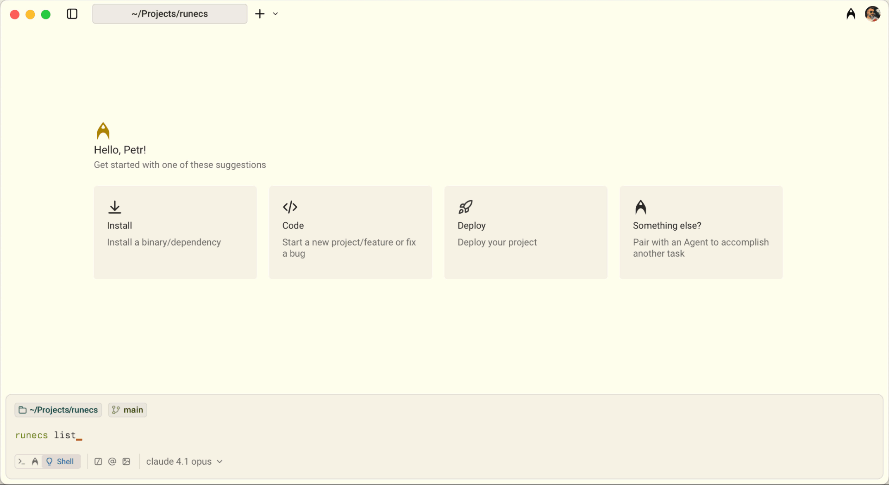

<div align="center">

# run(ECS)

<p align="center">Effortlessly run tasks and manage your services on AWS ECS.</p>

[](https://github.com/meap/runecs/releases)
[](https://github.com/meap/runecs/releases/)

</div>

<p>
    
</p>

---

## Installation

RunECS is a cross-platform tool available for macOS, Linux, and Windows.

```bash
# Install via Homebrew (macOS/Linux)
brew install meap/runecs/runecs

# Or install from source
go install github.com/meap/runecs@latest
```

Pre-compiled binaries for all platforms are available on our [releases page](https://github.com/meap/runecs/releases).

## Configuration

### AWS Credentials

RunECS supports AWS credential configuration through environment variables as documented in the [AWS CLI Environment Variables guide](https://docs.aws.amazon.com/cli/v1/userguide/cli-configure-envvars.html). This approach integrates seamlessly with tools like [direnv](https://direnv.net/), enabling you to maintain distinct AWS account configurations, regions, and other settings on a per-directory or per-project basis. This makes it particularly useful for managing multiple AWS environments without the hassle of constantly switching profiles.

## Key Features

For a complete list of available commands, run `runecs --help`. Below are some common use cases to help you get started.

### Deploy a Specific Docker Image Tag

Deploy a specific Docker image tag or commit SHA to your ECS service. This is particularly useful for rolling back to a known-good version or deploying a specific build:

```bash
runecs deploy --service mycanvas-ecs-staging-cluster/web -i 9cd43549f03faf9bbc0ddc3eba8585f00098b240
```

### Run One-Off Commands in ECS

Execute one-off commands directly in your ECS environment, perfect for database migrations, maintenance tasks, or debugging within your configured VPC and security groups. This ensures your commands run with the same network access, environment variables, and IAM permissions as your services:

```bash
runecs run "echo \"HELLO WORLD\"" -w --service mycanvas-ecs-staging-cluster/web
```

RunECS supports both AWS Fargate and EC2 capacity providers, automatically selecting the appropriate launch type based on your service configuration. The `-w` flag waits for task completion and streams the full output to your terminal, making it ideal for interactive debugging and migration scripts.

### Restart ECS Services

Gracefully restart your ECS services without downtime, or force immediate task termination when needed:

```bash
runecs restart --service mycanvas-ecs-staging-cluster/addrp
```

By default, RunECS performs a rolling restart, replacing tasks one by one to maintain service availability. For situations requiring immediate task termination (such as clearing stuck processes or forcing configuration reloads), use the `--kill` flag to terminate all tasks at once, allowing ECS to spawn replacements according to your service's desired count.

## FAQ

#### How does this differ from AWS CLI?

While AWS CLI offers comprehensive control over ECS clusters, its extensive feature set can introduce significant complexity for everyday tasks. RunECS streamlines common ECS operations by focusing on the workflows developers use most frequently, providing an intuitive and efficient command-line experience without sacrificing functionality.
